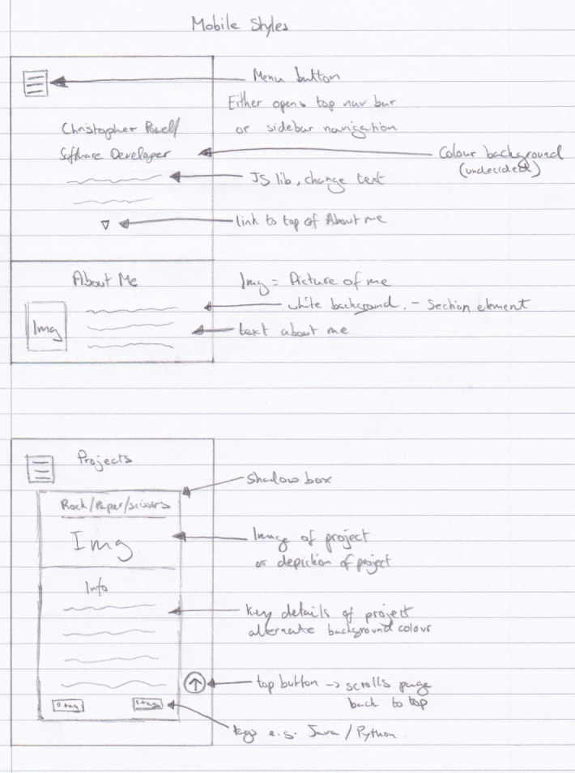
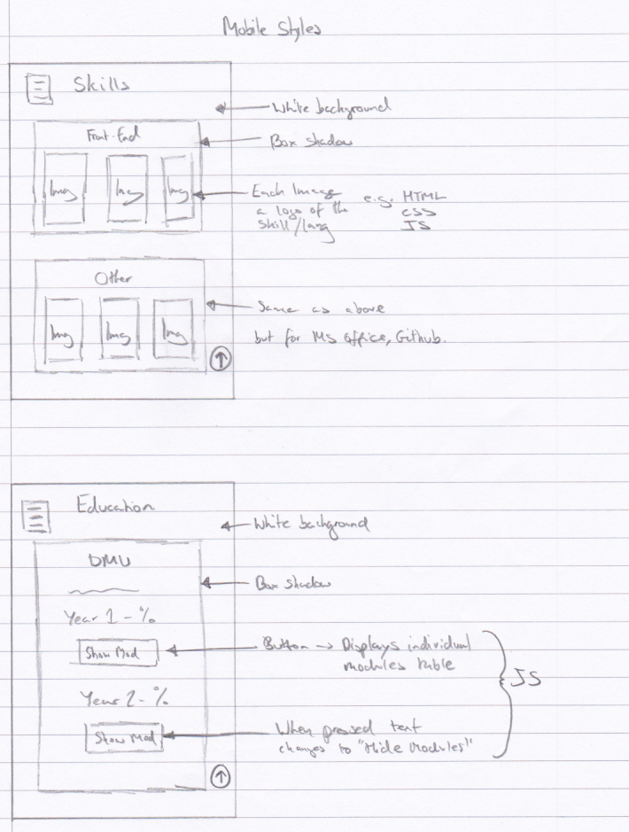
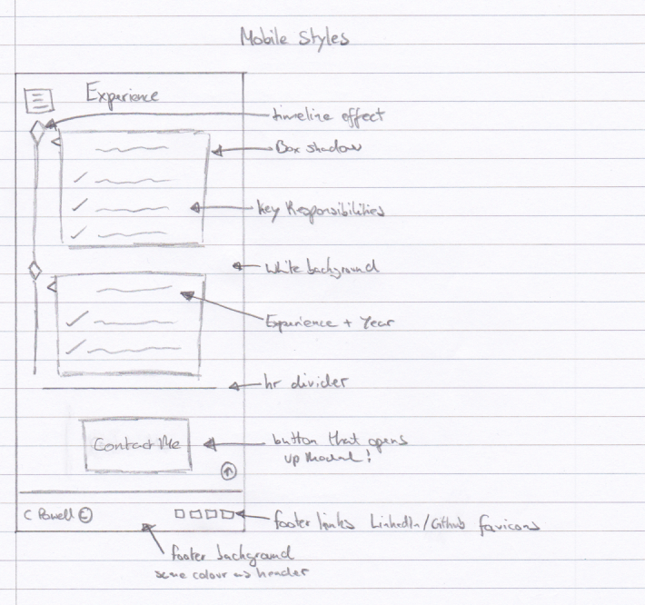

# PORTFOLIO WEBSITE

[View Website Here]( https://chrispylcfc.github.io/Portfolio-Website/).

## SKETCHES

- Mobile Design sketches of my portfolio website.
- Each page is a section of the Single Page Website.
- Tablet & Desktop styles in comparison to mobile:
  - Differ with header having an image instead of colour background.
  - Fixed navigation bar at the top.
  - Each article in each section are beside each other the larger the screen.

## KEY FEATURES

- Mobile Navigation - Press Hamburger, Overlapping page with semi-transparent background is shown with each link.
- The hamburger button animates when pressed to show the menu by rotating 90 degrees. This was done using Key Frames in CSS.
- Smooth Scroll when any links are pressed - Using scroll-behavior CSS property.
- Google Maps API, Responsive as location remains central when page size is altered.
- Contact Me modal is nice as it doesn't clutter up the website as it only displays when wanted and also shows nice use of JS.
- Header picture for Tablet/Desktop screens works well as the main focus of the image is seen on both screen sizes.
- The use of a 3rd Party Library for typewriting in Header has the desired effect.
- I have used CSS Flexbox throughout the website in order to layout the content and i feel this has worked successfully.

## ISSUES

- Unable to create a timeline with items either side for the larger screen sizes. This was because the example was not developed mobile first and adapting to mobile first was more difficult than i expected.
- Struggled to fit any animations / JSON api in to the website without it feeling random and out of place.
- The skills section isn't as good as i would have liked, this is partly due to the fact I struggled to find logo pictures of similar size and style. In future could adapt and use a third party programming logos - similar to font awesome.
- Coming up with the content for the website so in various places, dummy 'lorem ipsum' text is used as a placeholder. However the sections are still clear and distinct on what they will be about.
- Lastly avoiding excessive use of divs in the HTML has been difficult, i have used HTML5 semantic elements throughout but have used divs in order to group specific items together in order to either apply styling or use features like CSS Flexbox.

## DESIGN CONSIDERATIONS

#### PARC

| PRINCIPLE       | JUSTIFICATION |
|:---------------:|:-------------:|
| **Proximity**   | Proximity is achieved by having logical sections for the content and keeping all relevant items together. For example the projects are all very close together especially on desktop as the projects can be seen on one row.
| **Alignment**   | All the different sections are similarly aligned and positioned so that they are all aligned together. None of the content on the website is randomly placed, this is to avoid any confusion for the user and makes it easier on the eye to read the content. |
| **Repetition**  | The website takes in to consideration the design aspect of repetition by applying similar styles to all the different sections and controls on the website, thus giving everything the same look and feel. |
| **Contrast**    | The contrast has been achieved with various aspects of the website a different colour to highlight it. For example the footer and modal have a different coloured background to the rest of the elements on the sites. |

After putting the website through an accessibility checker it pointed a key contrast issue with the black text on a light grey background, after seeing this i have now changed the background of alternate table rows to be a much darker grey and with white text.

#### SITEMAP
Due to the website being a single page app a sitemap wouldn't be appropriate because there are no other html pages other than the index.html and one of the primary reasons for a sitemap is to help discover the different pages a website has.

## USER FEEDBACK

> Some of the colour scheme contrasts aren't clear enough. E.g. the button on the modal is one instance of this.

> The Navigation for the website is simple and accessible.

> External links to project git repositories could have been useful.

> No success message upon form submit.

Changes made to satisfy user feedback.

## REFERENCES

- Images
  - First Reference
  - Second Reference
  - etc...

- Tutorials
  - First Reference
  - Second Reference
  - etc...

- 3rd Party Libraries
  - First Reference
  - Second Reference
  - etc...
